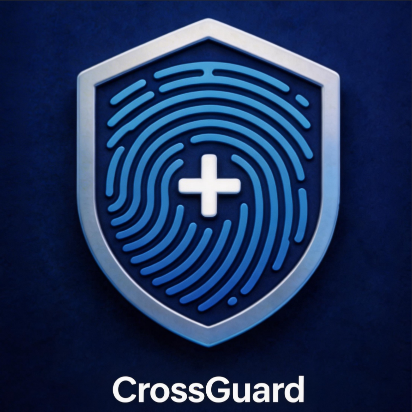

<p align="center">
  
</p>

<h1 align="center">CrossGuard — 让每一个浏览器身份都独一无二</h1>

<p align="center">
  🛡️ 基于 Chromium 138 的开源指纹浏览器 · 多环境隔离 · 全参数指纹伪装 · AI / RPA 自动化<br>
  <sub>一个软件，管理无限个互不关联的浏览器身份</sub>
</p>

<p align="center">
  
  
  
  
  
  
</p>

---

## 🎯 你是否遇到过这些问题？

- ❌ 多账号被平台关联封号，苦心经营的店铺/账号一夜清零
- ❌ 同一台电脑开多个浏览器，Cookie、指纹互相污染
- ❌ 代理换了 IP，时区/语言/地理位置却对不上，一眼被识破
- ❌ 指纹浏览器要么贵得离谱，要么闭源不透明、不敢用
- ❌ 想让 AI 帮你自动操作浏览器，却没有现成的接入方式

**CrossGuard 就是为解决这些问题而生。**

---

## ✨ 六大核心优势

### 1. 🧬 25+ 维度全参数指纹伪装
不止 Canvas。从 UserAgent、时区、语言，到 WebGL、音频、字体、ClientRects、SSL/TLS 握手、主机名、MAC 地址……**每一个可能暴露你身份的维度，都能独立配置**。支持「自定义 / 噪音 / 跟随 IP」三种模式，组合出无限真实身份。

### 2. 🌐 IP 智能联动，细节自洽
启用代理后，CrossGuard **自动**根据出口 IP 匹配正确的时区、语言、地理位置、语音引擎——再也不用担心「美国 IP + 北京时区」这种低级破绽。配套 DNS 防泄露与 WebRTC 真实 IP 保护，代理链路滴水不漏。

### 3. 🤖 双引擎自动化：AI（MCP）+ 零代码 RPA
- **MCP AI 自动化**：内置 MCP（Model Context Protocol）服务——**让 Claude、Cursor 等 AI 直接远程操控你的指纹浏览器**。13 个工具覆盖「选环境 → 启动 → 导航 → 执行 JS → 截图 → Cookie → 关闭」全流程。
- **RPA 流程自动化**：31 个动作的可视化编排器（参照影刀），选环境 → 拖步骤 → 手动 / 定时运行。支持 CSS / XPath、变量 `{{VAR}}`、条件 / 循环 / try 子流程、网络抓包转步骤——**不懂代码也能搞定复杂自动化**。

> 告诉 AI「打开环境 7，登录协作平台，截图待办」它就帮你做完；或用 RPA 把重复操作录成可定时复跑的流程。

### 4. 🗂️ 真正的多环境隔离
每个环境拥有独立的 Cookie、LocalStorage、历史记录、缓存、指纹配置。**N 个环境 = N 台独立的电脑**，互不干扰，一键切换。

### 5. 🔬 接近 100% 检测真实度
针对 BrowserScan、CreepJS 等主流检测深度优化。Canvas/WebGL 注入无篡改痕迹，UACH（Client Hints）与 UA 始终自洽。**经得起专业检测站的考验**。

### 6. 💎 开源 · 透明 · 免费
基于 GPL 协议开源，代码可审计、可二次开发。没有订阅费，没有隐藏后门，没有「云端同步你的账号数据」。**你的指纹，你做主。**

---

## 🚀 典型使用场景

| 场景 | 怎么用 |
|------|--------|
| 🛒 **跨境电商** | 亚马逊 / Shopify / 独立站多店铺防关联，一环境一店 |
| 📱 **社媒矩阵** | TikTok / Instagram / X 多账号运营，批量养号不掉链 |
| 📣 **广告投放** | Facebook / Google Ads 多账户管理，避免封户连坐 |
| 🕷️ **数据采集** | 高频爬虫自动切换指纹与代理，绕过反爬风控 |
| 🪙 **Web3 / 空投** | 多钱包交互、交互任务，互不关联防女巫检测 |
| 🤖 **AI Agent** | 用 MCP 让 AI 驱动浏览器，自动化填表、监控、报表 |
| 🔒 **隐私防护** | 对抗广告追踪与浏览器指纹画像，保护真实身份 |

---

## 🛠️ 功能全景

**指纹伪装**：UserAgent · UACH/Client Hints · Platform · 语言 · 时区 · Do Not Track · Canvas · WebGL · WebGPU · AudioContext · ClientRects · 字体 · 语音 · 分辨率 · CPU/内存 · 媒体设备 · 设备名/主机名 · MAC 地址 · SSL/TLS · 硬件加速 · 端口

**网络与代理**：HTTP / HTTPS / SOCKS4 / SOCKS5 · 用户名密码认证 · IP 智能联动（时区/语言/地理/语音）· WebRTC 防泄露 · DNS 防泄露

**环境管理**：Material-3 风格 Web UI · 一键创建/编辑/启动 · Cookie/LocalStorage 完全隔离 · Cookie 注入 · 出口 IP 一键检测

**AI / RPA 自动化**：MCP 协议 · 13 个工具 · Bearer Token 鉴权 · 支持远程部署；RPA 31 动作可视化编排 · CSS/XPath · 变量与子流程 · 定时调度 · 抓包转步骤

**插件与云端**：本地 CRX / Chrome 商店 / Edge 商店安装扩展 · 每环境独立启用；独立后端 CrossGuardServer 多机同步（书签/历史推送拉取、完整环境快照）

**工程质量**：Chromium 138 最新内核 · 各类重型 SPA 长时稳定 · BrowserScan ≈100% 真实 · 管理 UI 本地构建离线可用 · 安装包体积优化（≈170MB）

---

## 📊 为什么选 CrossGuard？

| | CrossGuard | 商业指纹浏览器 | 普通浏览器+插件 |
|---|:---:|:---:|:---:|
| 开源可审计 | ✅ | ❌ | ✅ |
| 内核版本 | Chromium 138 | 常滞后 | 最新 |
| 指纹维度 | 25+ | 20+ | 仅 UA/Cookie |
| IP 智能联动 | ✅ | ✅ | ❌ |
| AI 自动化 (MCP) | ✅ 独家 | ❌ | ❌ |
| RPA 流程自动化 | ✅ 31 动作 | ❌ / 需另购 | ❌ |
| 云端多机同步 | ✅ 开源自部署 | ✅ 闭源托管 | ❌ |
| 插件管理 | ✅ 每环境独立 | ✅ | ✅ |
| 订阅费用 | **免费** | 💰💰💰 | 免费 |
| 多环境隔离 | ✅ | ✅ | ❌ |

---

## ⬇️ 立即开始

```bash
# Windows 10/11 (64-bit)
# 下载安装包，或从源码运行：
cd CrossGuardLauncher/
python launcher.py   # 启动管理界面 + Chrome
```

访问 http://127.0.0.1:18900 打开管理界面，3 步创建你的第一个指纹环境。

📖 完整文档见 [README.md](README.md)

---

<p align="center">
  <b>别让指纹暴露你的身份。<br>CrossGuard，给你一千个互不关联的数字身份。</b>
</p>

<p align="center">
  <sub>Chromium 138 · v2.3.13 · GPL · Made for privacy & automation</sub>
</p>
