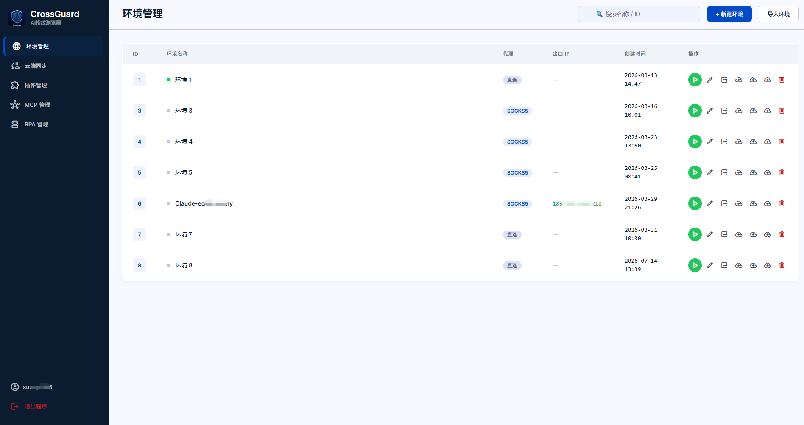
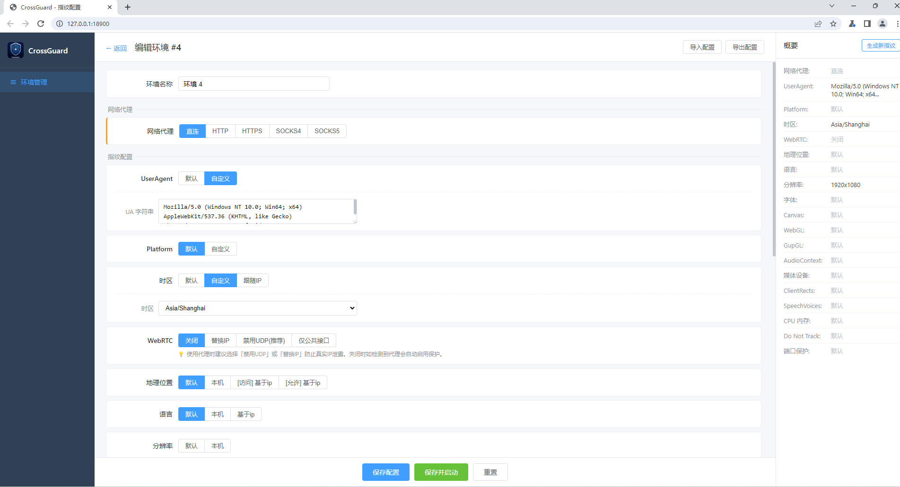
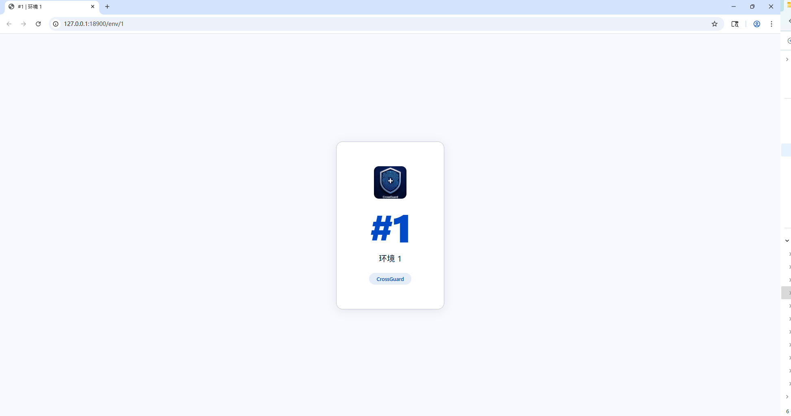
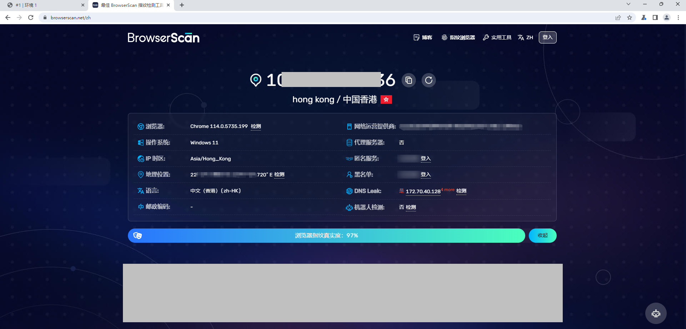
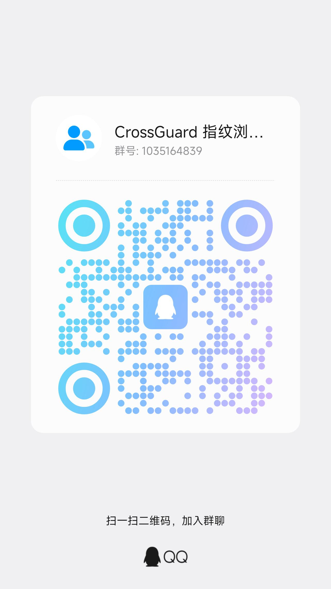

<p align="center">
  
</p>

<h1 align="center">CrossGuard</h1>

<p align="center">
  基于 Chromium 138 的开源指纹浏览器，支持多环境隔离、全参数指纹配置与 AI / RPA 自动化
</p>

<p align="center">
  
  
  
  
  
  
</p>

---

## 功能特性

### 指纹与环境
- **多环境隔离** — 每个环境独立的 Cookie、历史记录、LocalStorage、扩展，互不干扰
- **全参数指纹配置** — 覆盖 25+ 浏览器指纹维度，支持「默认 / 本机 / 噪音 / 基于IP」多种模式
- **IP 智能联动** — 代理启用时自动根据出口 IP 设置时区、语言、地理位置、语音
- **WebRTC 防护** — 检测到代理时自动保护真实 IP 不泄露
- **DNS 防泄露** — 内置 DNS 泄露防护，杜绝代理下的 DNS 请求外泄
- **设备指纹伪装** — 主机名 / MAC 地址 / SSL-TLS 握手 / 硬件加速全链路伪装
- **UACH 自洽** — 完整 User-Agent Client Hints，平台版本与 UA 始终一致，绕过现代指纹检测
- **指纹真实度高** — BrowserScan 检测接近 100% 真实度（Canvas / WebGL 无篡改痕迹）
- **重型网站稳定** — 深度适配各类重型 SPA 网站，长时间运行不崩溃

### 网络
- **代理支持** — HTTP / HTTPS / SOCKS4 / SOCKS5，支持用户名密码认证，一键检测出口 IP / 归属地

### 自动化
- **🤖 MCP AI 自动化** — 内置 MCP 服务，让 AI（Claude / Cursor / 任意 MCP 客户端）远程「选环境 → 启动 → 控制浏览器」，13 个工具覆盖导航 / 执行脚本 / 截图 / Cookie / 标签页全流程
- **🤖 RPA 流程自动化** — 31 个动作的可视化流程编排器（参照影刀），支持 CSS / XPath 选择器、变量 `{{VAR}}`、条件 / 循环 / try-catch 子流程、定时调度、网络抓包转步骤

### 管理与协作
- **插件管理** — 本地 CRX / Chrome 应用商店 / Edge 应用商店三种安装方式，每个环境独立启用 / 禁用扩展
- **云端同步** — 独立后端服务，多机同步环境（推送 / 拉取书签与浏览历史、上传完整环境快照）
- **Material-3 管理界面** — 全新 Tailwind + Material Design 3 风格 Web UI，本地构建、离线可用、零外部依赖
- **常驻系统托盘** — 启动即驻留系统托盘，关闭主窗口最小化到托盘后台运行，右键托盘一键退出并关闭所有环境进程
- **AI 对话 + Agent** — 每个环境浏览器内置 AI 助手（右上角按钮 + 右侧面板）；**Agent 模式**下 LLM 经 function-calling 调用工具实际控制当前浏览器（截图 / 导航 / 点击 / 填表 / 提取数据 / 执行 JS），截图可喂 vision 模型分析；支持配置多个 OpenAI 兼容模型（Kimi / GLM / DeepSeek / 通义 / OpenAI / Ollama），API Key 加密存储于本机、永不下发

## 截图

### 环境管理



### 指纹配置



### 环境首页



### 指纹检测 (BrowserScan ≈100%)



## 工作原理

CrossGuard 的指纹配置在「管理界面编辑 → 加密传递 → 渲染进程注入」三层间流转，**不收集真实设备数据外传**：

```
Python 启动器 (config)  ──AES 加密 JSON──▶  Chrome C++ 进程
                                                  │
                                          Mojo IPC 传递到渲染进程
                                                  ▼
                                       Blink 渲染引擎注入指纹
                                       （覆盖返回值 + 输出噪音）
```

- **指纹管道**：Python 配置 → AES 加密 JSON → Chrome C++ 读取 → Mojo IPC → Blink renderer 注入
- **Cookie 注入**：走 CDP（Chrome DevTools Protocol），不经过指纹管道
- **数据流向**：启动器仅**单向拉取**本机指纹配置（`127.0.0.1`，AES 加密，仅含 `timestamp + id`），无任何回传
- Chromium 138 补丁已通过三维度安全审计（网络外传 / 后门执行 / 数据窃取），**无病毒 / 后门 / 数据外传**

## 支持的指纹参数

| 分类 | 参数 | 模式 |
|------|------|------|
| 基础信息 | UserAgent | 默认 / 自定义 |
| 基础信息 | UACH / Client Hints | 跟随 UA / 自定义 |
| 基础信息 | Platform | 默认 / 自定义 |
| 基础信息 | 语言 | 默认 / 本机 / 基于IP |
| 基础信息 | 时区 | 默认 / 自定义 / 跟随IP |
| 基础信息 | Do Not Track | 默认 / 本机 / 自定义 |
| 网络 | 代理 | 直连 / HTTP / HTTPS / SOCKS4 / SOCKS5 |
| 网络 | WebRTC | 关闭 / 替换IP / 禁用UDP / 仅公共接口 |
| 网络 | 地理位置 | 默认 / 本机 / 基于IP |
| 网络 | DNS 泄露防护 | 开 / 关 |
| 网络 | SSL / TLS 指纹 | 默认 / 自定义 |
| 硬件 | 分辨率 | 默认 / 本机 |
| 硬件 | CPU / 内存 | 默认 / 本机 |
| 硬件 | 媒体设备 | 默认 / 本机 |
| 硬件 | 设备名 / 主机名 | 默认 / 自定义 |
| 硬件 | MAC 地址 | 默认 / 噪音 / 自定义 |
| 硬件 | 硬件加速 | 开 / 关 |
| 渲染 | Canvas | 默认 / 本机 / 噪音 |
| 渲染 | WebGL | 默认 / 本机 / 噪音 |
| 渲染 | GupGL | 默认 / 本机 / 噪音 |
| 渲染 | ClientRects | 默认 / 本机 / 噪音 |
| 音频 | AudioContext | 默认 / 本机 / 噪音 |
| 字体 | 字体列表 | 默认 / 本机 / 噪音 |
| 语音 | SpeechVoices | 默认 / 本机 / 噪音 / 基于IP |
| 安全 | 端口保护 | 默认 / 本机 |

## 🤖 MCP AI 自动化

CrossGuard 内置 MCP（Model Context Protocol）服务，让 AI 客户端（Claude / Cursor / 任意 MCP Host）**远程控制各指纹环境浏览器**，实现端到端自动化。

**13 个工具**：环境管理（`list_environments` / `launch_environment` / `close_environment` / `list_running`）+ 页面自动化（`navigate` / `evaluate_script` / `screenshot` / `get_cookies` / `set_cookies` / `list_tabs` / `new_tab` / `close_tab`）。

在 AI 客户端配置 `.mcp.json`：

```json
{
  "mcpServers": {
    "crossguard": {
      "url": "http://<机器IP>:18901/mcp",
      "headers": { "Authorization": "Bearer <Token>" }
    }
  }
}
```

Token 在管理界面「MCP 管理」一键生成 / 重置。典型流程：`list_environments → launch_environment(id) → navigate → evaluate_script → screenshot → close_environment`。

## 🤖 RPA 流程自动化

内置可视化流程编排器（参照影刀），无需写代码即可编排多步骤自动化任务。**选环境 → 编排步骤 → 手动 / 定时运行**，变量用 `{{VAR}}` 在步骤间传递。

**31 个动作**：

| 分类 | 动作 |
|------|------|
| 基础网页 | 打开页面 / 点击 / 输入 / 提取 / 截图 / 执行JS / 滚动 / hover / select / check |
| 流程控制 | if / loop / break / continue / try / retry / condition |
| 元素增强 | hover / select_option / check / scroll / get_attribute / element_exists / upload_file |
| 数据处理 | set_var / calc / regex / json / 对象变量 JS 求值 |
| 输出集成 | http 请求 / file 写文件 / csv / log / notification 通知 |

- **选择器**：CSS / XPath 双支持
- **定时调度**：每日定点 / 间隔运行
- **子流程嵌套**：if / loop / try 支持子流程编辑栈
- **网络抓包**：注入 hook 抓取环境浏览器请求 → 一键「转步骤」（自动补 Cookie）
- **截图保存**：可指定自定义保存目录

## 插件与云端

- **插件管理**：在「插件管理」页安装扩展（本地 CRX 文件 / Chrome 商店 URL / Edge 商店 URL）；每个环境在编辑页独立勾选启用哪些扩展，启动时按环境加载。
- **云端同步**：搭配独立后端 [`CrossGuardServer`](../CrossGuardServer/)（Go + MySQL + Redis，端口 8080），实现多机环境同步 —— 推送 / 拉取书签与浏览历史、上传完整环境快照。在「云端同步」页配置服务器地址并登录即可使用。

## 快速开始

### 环境要求

- Windows 10/11 (64-bit)
- Python >= 3.10（推荐 3.14）
- `pip install pycryptodome`

### 运行

```bash
cd CrossGuardLauncher/

# 启动管理界面 + Chrome
python launcher.py

# 仅启动 HTTP 服务（不启动 Chrome）
python launcher.py --no-launch

# 指定 chrome 路径和端口
python launcher.py --chrome "path/to/chrome.exe" --port 18900
```

启动后访问 http://127.0.0.1:18900 打开管理界面。

> 管理 UI 的样式资源（`web_assets/`）需先构建：`cd web_assets && npm install && npm run build`（产物 `dist/app.css` + 字体由启动器在 `/app.css`、`/fonts/*` 提供）。

### 打包

```bash
cd CrossGuardLauncher/
pip install pyinstaller

# 完整打包：exe + 免安装包 + Inno Setup 安装程序（每次自动 +1 第三段版本号）
python build.py

# 不含 Chrome 运行时（仅 Launcher）
python build.py --no-chrome

# 调试打包时不自动递增版本号
python build.py --no-bump
```

生成安装程序需要 [Inno Setup 6](https://jrsoftware.org/isdl.php)。产物在 `installer_out/CrossGuard_Setup_<version>.exe`。

## 项目结构

```
CrossGuard/                 # Chromium 138 补丁文件 (覆盖到 chromium/src/)
├── chrome/                 #   浏览器进程补丁
│   └── app/                #     启动入口、AES 加解密、指纹 JSON 解析
├── third_party/blink/      #   Blink 渲染引擎补丁 (指纹注入核心)
├── content/                #   字体代理、Mojo IPC
├── components/             #   UA、语言、权限补丁
├── base/                   #   指纹全局单例
├── cc/                     #   命令行 switch 定义
├── net/                    #   主机名、MAC 地址欺骗
├── ui/                     #   分辨率欺骗、Logo
└── assets/                 #   截图资源

CrossGuardLauncher/         # Python 启动器 (独立目录)
├── launcher.py             #   HTTP 服务 + Chrome 环境管理 + RPA 引擎调度
├── rpa_engine.py           #   RPA 流程执行引擎 (31 动作)
├── crossguard_mcp.py       #   MCP 服务 (13 工具)
├── config.html             #   Web 管理界面 (Material-3 / Tailwind SPA)
├── web_assets/             #   前端资产源码 + Tailwind 构建
│   ├── src/app.css         #     @apply 重定义组件样式
│   ├── tailwind.config.js  #     Material-3 调色板 / token
│   └── copy-fonts.js       #     字体本地化（vendor）
├── build.py                #   打包脚本（版本自动递增、安装包瘦身）
└── docs/                   #   开发文档
```

详细文档见 [`CrossGuardLauncher/docs/`](../CrossGuardLauncher/docs/):
- [编译打包指南](../CrossGuardLauncher/docs/BUILD.md)
- [Chromium 编译参数](../CrossGuardLauncher/docs/CHROMIUM_BUILD_ARGS.md)
- [架构说明](../CrossGuardLauncher/docs/ARCHITECTURE.md)
- [配置路径说明](../CrossGuardLauncher/docs/CONFIG.md)
- [二次开发指南](../CrossGuardLauncher/docs/DEVELOPMENT.md)

## 安全与隐私

- Chromium 138 补丁已通过三维度安全审计（**网络外传 / 后门执行 / 数据窃取**），结论：无病毒、无后门、无数据外传。
- 指纹机制为「覆盖返回值 + 输出噪音」，**不收集真实设备数据**。
- 启动器与浏览器间通信仅在 `127.0.0.1` 本机回环，指纹配置 AES 加密传递。
- 完全开源（GPL），可自行审计与编译。

## 联系我们

QQ群：1035164839




> 请注意保护您的隐私和安全，在加入公开讨论群组时谨慎提供个人信息。

---

**License**: GPL
